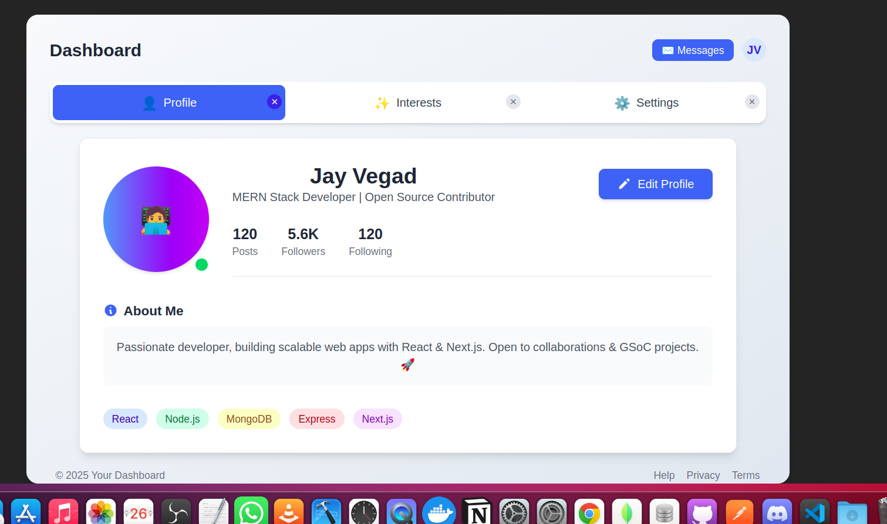
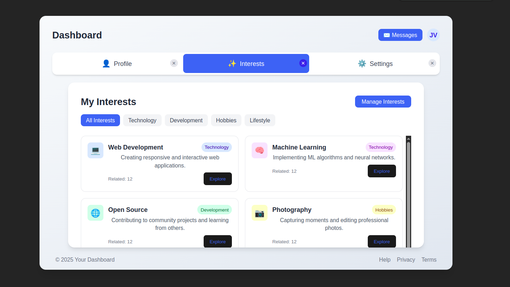
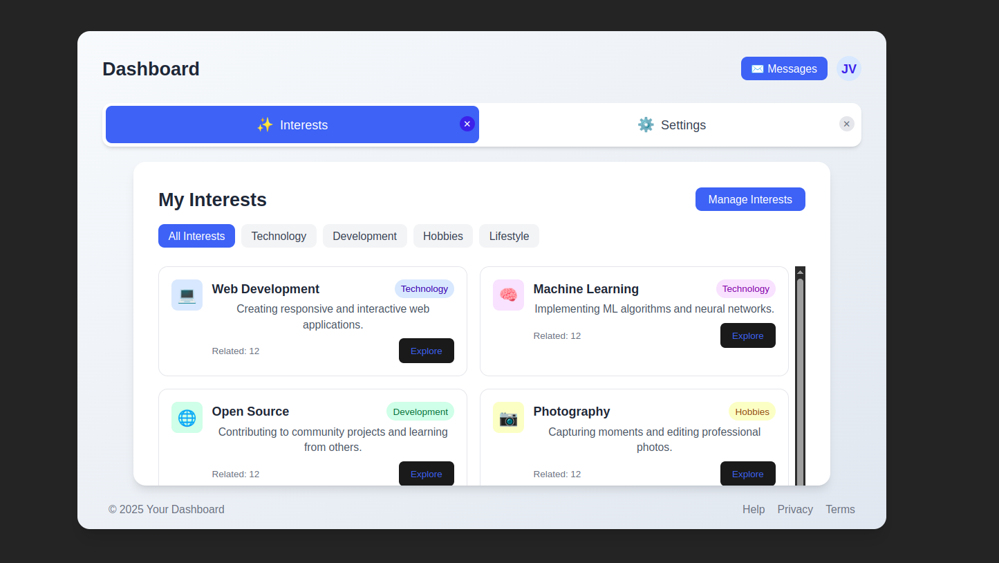
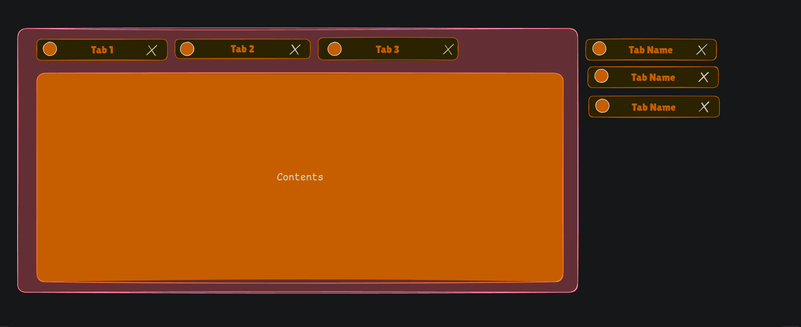

# Dashboard UI Project

A responsive and interactive dashboard UI built with React and Tailwind CSS, featuring a tabbed interface with dynamic tab management.

- Companys = Myntra, Zepto.

## Tips

- **This round will probably last 2 to 3 hours, and within this time, you must implement the required functionality. Do not focus on improving the UI; keep it as simple as possible. If you have time left after completing the functionality, then you can work on enhancing the UI. Please keep this in mind. ALL THE BEST! for interview**


## Features

- 📑 Tab-based navigation between different sections
- ❌ Ability to close tabs dynamically
- 👤 Profile view with user statistics
- ⚙️ Comprehensive settings management
- ✨ Interest management functionality
- 🎨 Beautiful gradient backgrounds and shadow effects

# Note:- 

- **All pages (Profile, Settings, Interests) are initially created using AI. However, during the interview, AI assistance is not allowed. Ensure that the pages are functional and presentable. Focus on making them clean and user-friendly. If you have extra time after completing the required functionality, you can further enhance the UI.**


## Screenshots

### Dashboard Overview

*Main dashboard view showing the tabbed interface with the Profile tab active.*

### Interest Panel

*Comprehensive interest panel with multiple configuration options.*

### Close Tab Functionality

*This is close tab functionality this is require to make so please do not forgot to make this.*

### Tab Management

*This is simple basic wireframe that i made in excalidraw and this is optional do not need to make this.*

## Project Structure

```
dashboard-ui/
├── src/
│   ├── components/
│   │   ├── Mainscreen.jsx     # Main dashboard container
│   │   └── ...
│   ├── pages/
│   │   ├── Profile.jsx        # User profile page
│   │   ├── Setting.jsx        # Settings configuration page
│   │   └── Intrest.jsx        # User interests page
│   ├── App.jsx                # Root application component
│   └── index.js               # Application entry point
├── public/
│   └── index.html             # HTML template
├── package.json               # Project dependencies
└── tailwind.config.js         # Tailwind CSS configuration
```

### Tab Management System

The tab management system is implemented with React state hooks:

```jsx
const [currentPage, setCurrentPage] = useState(0);
const [tabs, setTabs] = useState([
    {
        "id": 1,
        "title": "Profile",
        "icon": "👤",
        "component": <Profile />
    },
    // Additional tabs...
]);
```

Tab closing functionality:

```jsx
const closeTab = (e, index) => {
    e.stopPropagation(); // Prevent the tab from being selected when closing
    
    // Create a new array without the closed tab
    const newTabs = [...tabs];
    newTabs.splice(index, 1);
    
    // Update the state with the new array
    setTabs(newTabs);
    
    // Adjust the current page index if needed
    if (index === currentPage) {
        if (index > 0) {
            setCurrentPage(index - 1);
        } else if (newTabs.length > 0) {
            setCurrentPage(0);
        }
    } else if (index < currentPage) {
        setCurrentPage(currentPage - 1);
    }
}
```

### UI Components

#### Main Dashboard Container

The main container uses a flexible layout with fixed height:

```jsx
<div className="container h-[40rem] p-8 w-[65rem] bg-gradient-to-br from-slate-50 to-slate-200 rounded-2xl flex flex-col gap-5 shadow-xl">
    {/* Dashboard content */}
</div>
```

#### Tab Navigation

Tab navigation with active states and close buttons:

```jsx
<div className="tab-container h-14 w-full bg-white rounded-xl flex items-center p-1 gap-2 shadow-md">
    {tabs.map((tab, index) => (
        <button
            key={index}
            onClick={() => changeIndex(index)}
            className={`h-full flex-1 flex items-center justify-center gap-2 rounded-lg transition-all relative ${
                currentPage === index
                    ? "bg-blue-500 text-white font-medium"
                    : "bg-transparent text-gray-700 hover:bg-gray-100"
            }`}
        >
            <span className="text-lg">{tab.icon}</span>
            <span className="font-medium">{tab.title}</span>
            {/* Close button */}
            {tabs.length > 1 && (
                <span 
                    onClick={(e) => closeTab(e, index)}
                    className={`absolute top-1 right-1 w-5 h-5 flex items-center justify-center rounded-full text-xs ${
                        currentPage === index 
                            ? "bg-blue-600 text-white hover:bg-blue-700" 
                            : "bg-gray-200 text-gray-500 hover:bg-gray-300"
                    }`}
                >
                    ✕
                </span>
            )}
        </button>
    ))}
</div>
```

## Installation and Setup

1. Clone the repository:
   ```bash
   git clone https://github.com/yourusername/dashboard-ui.git
   cd dashboard-ui
   ```

2. Install dependencies:
   ```bash
   npm install
   ```

3. Start the development server:
   ```bash
   npm start
   ```

4. Open your browser and navigate to `http://localhost:5173`

## Dependencies

- React 18.x
- Tailwind CSS 3.x (Note: Some companies may not allow the use of Tailwind CSS. In such cases, you should write simple external CSS instead). 
- React Router 6.x (for potential route-based navigation)

## Best Practices Implemented

- Component-based architecture (must use (If you do not use it fine but suggest to use this.)).
- State management using React Hooks
- Responsive design with Tailwind CSS (If you made it's fine but not compulsary but some company said to compaulsory).
- Dynamic component rendering
- Event handling with proper propagation control
- Conditional rendering for UI elements
- Semantic HTML for better accessibility