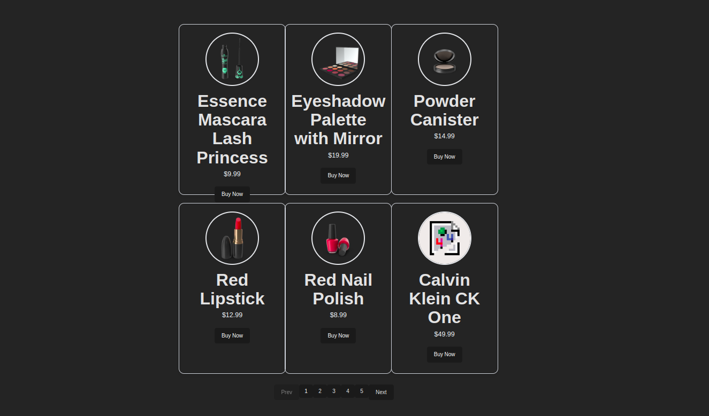
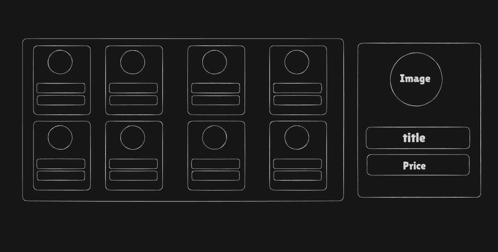

# PAGINATION MACHINE CODING PROBLEM (SWIGGY FLIPKART)

## Problem Overview

This repository contains a React-based product grid implementation with pagination functionality, commonly used in e-commerce applications and online marketplaces.

## Demo Screenshot For Basic Idea.

- Website Image.

  

- Basic Wireframe On Excaliadraw.

  

## The Component

**Core Functionality:** Display a grid of products fetched from an API with paginated navigation.

This component demonstrates several key frontend skills:
- Fetching and displaying data from an API
- Implementing pagination
- Creating responsive grid layouts
- State management in React

## Implementation Details

The solution includes:

1. A main `Grid` component that:
   - Fetches product data from the dummyjson API
   - Manages pagination state
   - Slices the data for the current page
   - Renders product cards in a grid layout

2. A complementary `Card` component that:
   - Displays product images, title, and price
   - Creates a consistent card layout for each product

## Code Explanation

The implementation uses React hooks (`useState`, `useEffect`) to manage state and handle API calls:

- `productData` stores the array of products retrieved from the API
- `currentPage` tracks which page the user is currently viewing
- `PER_PAGE_ITEMS` constant defines how many items appear on each page

The pagination logic:
- Calculates total number of pages based on product count and items per page
- Identifies start and end indices for the current page slice
- Renders pagination controls for navigating between pages

## Technical Stack

- React (with Hooks)
- Tailwind CSS for styling
- Fetch API for data retrieval

## How to Use

1. Import the Grid component into your project
2. Ensure Card component is properly implemented and imported
3. The grid will automatically fetch products from "https://dummyjson.com/products"
4. Users can navigate through pages using the pagination controls

## Possible Enhancements

- Add loading indicators during data fetching
- Implement error handling for API failures
- Add filtering and sorting capabilities
- Implement responsive design for mobile devices
- Add image carousels for products with multiple images
- Include product details like ratings and descriptions

## Tips

- **This round will probably last 2 to 3 hours, and within this time, you must implement the required functionality. Do not focus on improving the UI; keep it as simple as possible. If you have time left after completing the functionality, then you can work on enhancing the UI. Please keep this in mind. ALL THE BEST! for interview**

